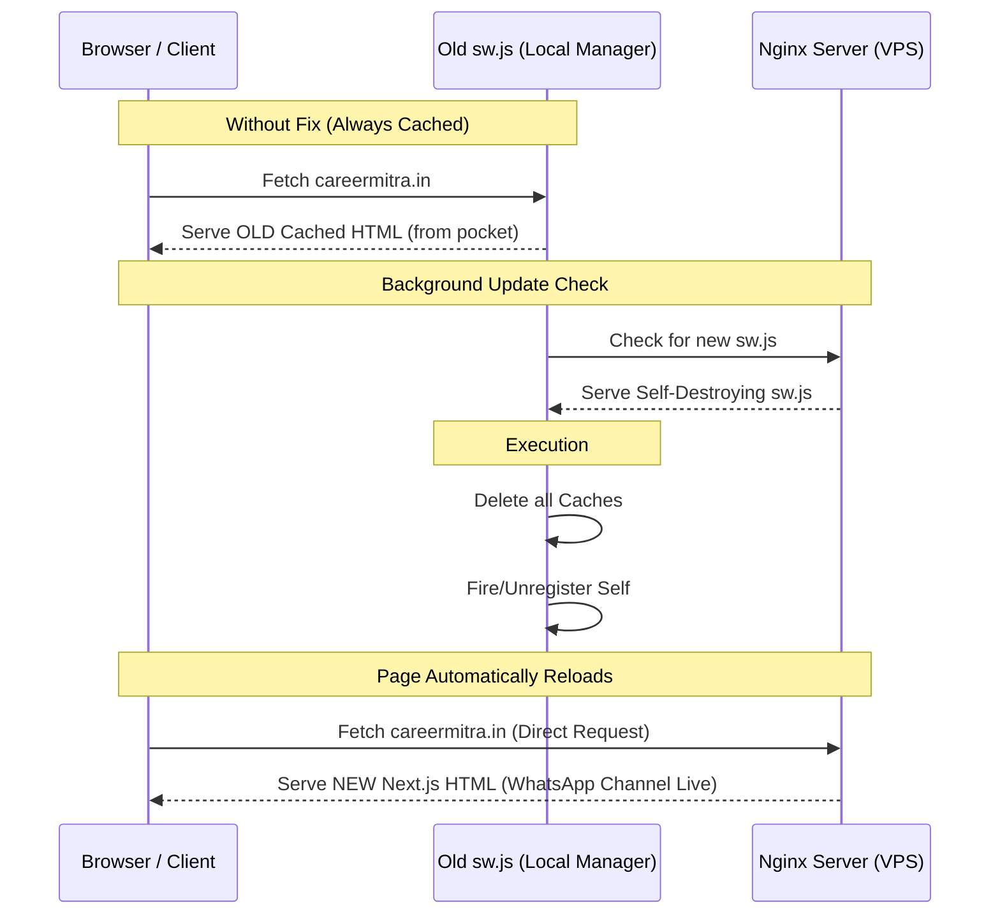

# Incident Report: PWA Caching & Deployment Debugging
**Project:** CareerMitra (Next.js Migration)  
**Date:** August 2, 2026  
**Status:** Resolved  

---

## 1. Executive Summary
Following the migration of the CareerMitra portal from **Vite + React** to **Next.js**, users reported that new deployments (such as the addition of the "WhatsApp Channel" section) were not visible unless they performed a hard reload in the browser. 

Our investigation revealed three main bottlenecks preventing live changes from appearing:
1. A **stale PWA Service Worker (`sw.js`)** from the old Vite build caching the main HTML page.
2. **Conflicting Cache-Control headers** between Next.js upstream server and Nginx reverse proxy.
3. **Diverged Git histories** on the VPS halting the GitHub Actions deployment pipeline.

---

## 2. Root Cause Analysis & Resolution

### Issue 1: Stale Service Worker (`sw.js`) Caching
* **The Cause:** The previous Vite-based application registered a Service Worker (`sw.js`) in users' browsers. This worker cached `index.html` locally. When Next.js was deployed, the browser loaded the page from the local cache offline, bypassing Nginx entirely. Simply deleting `sw.js` from the server resulted in a `404` check error, prompting the browser to keep running the old cached version indefinitely.
* **The Resolution:** We created a **self-destroying Service Worker** at `public/sw.js`. When the browser checks for updates, it pulls this new script, which deletes all local browser caches, unregisters itself, and reloads the page to serve the fresh Next.js content.

```javascript
// Inside public/sw.js (Self-Destroying Logic)
self.addEventListener('activate', (event) => {
  event.waitUntil(
    caches.keys().then((keys) => Promise.all(keys.map(k => caches.delete(k))))
      .then(() => self.registration.unregister())
      .then(() => self.clients.matchAll({ type: 'window' }))
      .then((clients) => clients.forEach(c => c.navigate(c.url)))
  );
});
```

---

### Issue 2: Conflicting Cache-Control Headers
* **The Cause:** When a user bypassed the service worker, Nginx served two conflicting headers:
  1. `cache-control: s-maxage=31536000` (Sent by Next.js, telling CDNs/browsers to cache the HTML for 1 year).
  2. `cache-control: no-store, no-cache...` (Sent by Nginx, telling browsers not to cache).
  
  This double-header caused browsers and CDNs (Cloudflare) to keep caching the old HTML.
* **The Resolution:** We added `proxy_hide_header Cache-Control;` inside the Nginx `/` block configuration to strip the Next.js header, leaving only the clean `no-store` header.

```nginx
# Nginx Configuration (/etc/nginx/conf.d/careermitra.conf)
location / {
    proxy_pass http://127.0.0.1:3000;
    proxy_hide_header Cache-Control; # Strips Next.js caching rules
    add_header Cache-Control "no-store, no-cache, must-revalidate, proxy-revalidate, max-age=0";
}
```

---

### Issue 3: Git History Divergence in GitHub Actions
* **The Cause:** In order to protect private database keys and Firebase credentials committed to GitHub by accident, we performed a Git history rewrite and force-pushed to GitHub. The local git repository on the VPS had a diverged commit history, causing `git pull` in the GitHub Actions runner script to fail with exit code `128`.
* **The Resolution:** We modified the GitHub Actions deploy script (`.github/workflows/deploy.yml`) to use `git reset --hard origin/$BRANCH` instead of `git pull`. This forces the VPS deployment folder to strictly align with GitHub's current branch state, disregarding local commit conflicts.

```diff
- git pull origin $BRANCH
+ git reset --hard origin/$BRANCH
```

---

### Issue 4: Firebase Client-side VAPID Key Initialization
* **The Cause:** Next.js environment variables (prefixed with `NEXT_PUBLIC_`) are injected at compile/startup time. The local dev server had been running for over 1.5 hours without restart, and the VAPID key was set to a placeholder, triggering the browser error: `FirebaseError: Installations: Missing App configuration value: "projectId"`.
* **The Resolution:** We replaced `NEXT_PUBLIC_FIREBASE_VAPID_KEY` with the active Firebase public VAPID key in the `.env` file and triggered a restart of the local server process.

---

## 3. How the Service Worker Fix Works (Analogy)

To easily explain this to non-technical stakeholders, we can use the **Local Manager Analogy**:



1. **The Old Setup:** The old PWA version installed a **local manager** (`sw.js`) inside the user's browser. You gave him a folder of cached files and told him: *"Whenever the user requests the site, hand them these cached files instantly."* This meant the browser never requested the new Next.js site from Nginx.
2. **The Problem:** Deleting the manager file from the server caused a `404` error when the browser checked for updates. Because it got a `404`, the browser assumed there was no update and kept running the old manager.
3. **The Fix:** We uploaded a new "manager contract" (`sw.js`). When the browser checked for updates in the background, it successfully fetched this file. The code inside instantly instructed the browser to **clear the cached files**, **uninstall the manager**, and **trigger a page reload**. The browser then successfully went straight to the server and downloaded the new Next.js page.
